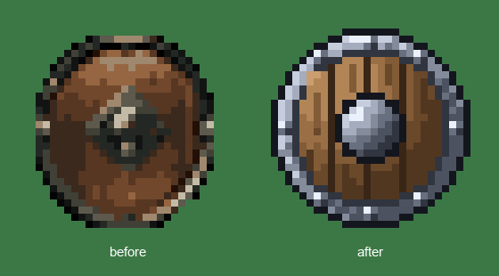

<p align="right"><a href="README.es.md">🇪🇸</a></p>

# Drawing Pixel Art

A skill for drawing and fixing pixel art sprites. The agent writes each sprite as a character map,
compiles it to PNG, and validates outline, holes, symmetry, framing, and relief before delivering it.

<p align="center"></p>

## How it works

Sprites are written as **character maps** (one character = one pixel = one palette color) and compiled
to PNG with [`scripts/pixelmap.py`](scripts/pixelmap.py):

```
map .txt  ──►  pixelmap.py render  ──►  PNG + 8x preview
                      │
                      └─ validates outline, holes, symmetry, framing, and relief
```

Already-approved silhouettes live in [`examples/`](examples/), and curve templates (circles by diameter) live in
[`references/shapes.md`](references/shapes.md).

## Installation

Copy the `drawing-pixel-art/` folder to wherever your agent looks for skills (`~/.claude/skills/`,
`~/.agents/skills/`, or the corresponding directory):

```bash
git clone https://github.com/rusocode/ruso-skills.git
cp -r ruso-skills/drawing-pixel-art ~/.claude/skills/
```

**Requirements:** Python 3 and Pillow.

```bash
pip install pillow
```

## Which model to use

The drawing has to be done by the strongest model you have on hand, with extended reasoning on; in
practice, **Opus**. This isn't a preference: `pixelmap.py` validates outline, holes, symmetry, framing, and that the
sprite isn't flat, but it **doesn't validate that the drawing is good**. A sprite can pass the full audit and still
have a 3-tone border, no texture, and a gradient that doesn't follow the volume.

Measured on the same task (fixing a 32x32 `wood_shield.png`, keeping the silhouette in both cases):

|                       |  Sonnet   |            Opus            |
|-----------------------|:---------:|:--------------------------:|
| Audit verdict         |   pass    |            pass            |
| Silhouette            | D=28, 88% |   D=28, 88% (identical)    |
| Fill tones / dominant | 11 / 26%  |          14 / 15%          |
| Perimeter border      |  3 tones  | 7 tones (normal-map bevel) |
| Rivets / grain        |   0 / 0   |           8 / 8            |

Both deliver a recognizable round shield and both pass every validation. The entire difference is in
step 7 (relief and texture), which is exactly what no script can measure for you.

> [!TIP]
> If the sprite comes out correct but bland, check which model you used before touching the map.

## How to ask for things

| What you want                                            | Prompt                                       |
|----------------------------------------------------------|----------------------------------------------|
| A new sprite                                             | `Create a torch sprite, 32x32`               |
| Fix an existing one                                      | `Fix the sprite at path/X.png`               |
| A specific change to an existing one                     | `Remove the little rock from path/stone.png` |
| A different color of the same sprite                     | `Add a green variant of the potion`          |
| Bring the map back in sync after editing the PNG by hand | `I edited X.png by hand, update its map`     |

Details worth keeping in mind:

- **Say "sprite", "texture", "item", or "icon"** somewhere: that's what triggers the skill.
- **Don't say "touch up" or "redraw."** That's the *result* of the diagnosis, not the instruction. Asking to
  "touch up" a sprite painted with 200 colors is impossible, and the instruction contradicts itself.
- **The size isn't necessary** if the sprite already exists: it comes from the file.

## What the skill decides and what you decide

Before touching an existing sprite, the skill runs `pixelmap.py audit --png X.png`, which **measures** the file and
dictates the technique:

| Verdict     | Diagnosis                                                         | What happens                                                                                          |
|-------------|-------------------------------------------------------------------|-------------------------------------------------------------------------------------------------------|
| **RETOUCH** | It's authored pixel art.                                          | The PNG is reopened as a map and corrected there. Anything untouched stays pixel-for-pixel identical. |
| **REDRAW**  | It's painted with a soft brush or downscaled from a larger image. | The pixels need to be placed by hand.                                                                 |

That's all the measurement resolves. When the verdict is REDRAW, there's **one** question left, and it's yours:

> **Is the silhouette kept or not?**
>
> - **Kept** → the original serves as a blueprint: same shape and composition, new pixels and shading.
> - **Not kept** → redesign: the shape is drawn from scratch.

If you don't specify, the skill asks before drawing the first row. You can settle it in advance with half a
sentence: `…, keeping the silhouette` or `…, the silhouette can change if it doesn't read well`.

## When it's worth explaining the reason

You don't need to justify what the audit already measures: extra colors, missing outline, flat sprite, tight
framing. You do need to when the problem is the **drawing** itself, because nothing measures that:

- *"can't tell what this is"*
- *"the silhouette is wrong, don't use it as a reference"*
- *"the pose is off"*
- *"the coins look like cookies"*

## What happens next

1. All work comes out in a drafts folder outside the real assets (the project's `sandbox/` if it exists;
   otherwise, the environment's scratchpad).
2. You get the PNG with an **8x enlarged preview**: nothing gets judged at 1x.
3. **Nothing enters the repo until you approve it.** Only then does the PNG go to the textures folder and the
   `.txt` map to `examples/`, the silhouette library that future sprites draw from.

> [!NOTE]
> Fixing the PNG yourself in an editor is part of the workflow, not an exception: it gets reimported with
> `from-png` and the map becomes the source again.

## Structure

| Path                                           | What it is                                                          |
|------------------------------------------------|---------------------------------------------------------------------|
| [`SKILL.md`](SKILL.md)                         | Instructions for the agent: the step-by-step drawing process.       |
| [`scripts/pixelmap.py`](scripts/pixelmap.py)   | CLI with `render` (map → PNG), `from-png` (PNG → map), and `audit`. |
| [`scripts/bands.py`](scripts/bands.py)         | Helpers for constant-width borders and light-based bevels.          |
| [`examples/`](examples/)                       | Approved maps: the silhouette library.                              |
| [`references/shapes.md`](references/shapes.md) | Curve templates (circles by diameter).                              |
